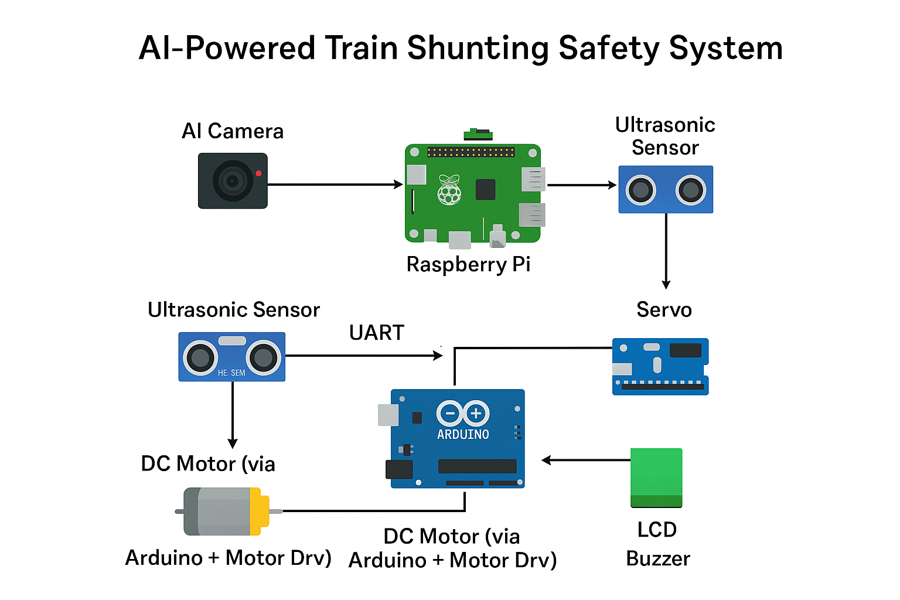

# 🚆 AI-Powered Train Shunting Safety System

This project is a prototype of a **train shunting safety system** that integrates an **AI Camera (Sony IMX500)**, **Raspberry Pi**, **Arduino**, **Ultrasonic Sensors**, **Servo Motor**, **DC Motors**, and **LCD Display** to ensure safe coupling of compartments and detection of human/animal interference.

---

## 📌 Features

- **Ultrasonic sensors**: Measure distance between train compartments
- **AI Camera (Sony IMX500)**: Detects humans/animals on tracks or near compartments
- **Raspberry Pi**: Runs object detection using YOLOv8 on AI Camera
- **Arduino**: Controls DC motors and LCD based on sensor & Pi signals
- **Servo motor**: Rotates the AI camera to scan surroundings
- **LCD Display**: Shows real-time status and distance
- **Alarm & Stop Mechanism**: Stops engine movement if obstacle detected

---

## 🛠️ Hardware Components

- Raspberry Pi 4 (connected with Sony IMX500 AI camera)
- Arduino Uno (or compatible Renesas UNO board)
- Ultrasonic Sensors (HC-SR04 × 2)
- DC Motors × 2 (engine bogie movement)
- Motor Driver Module (L298N)
- Servo Motor (for rotating camera)
- I2C 16×2 LCD Display
- Alarm Buzzer
- Power Supply

---

## 📁 Project Structure

```
railway-shunting-safety/
├── README.md                           # Project documentation
├── recognition.py                      # Raspberry Pi + AI Camera + Servo main code
├── arduino_code/            
│   └── bogie_control.ino              # Arduino code (motor, LCD, ultrasonic, serial)
├── imx500-models-backup/
│   └── imx500_network_yolov8n_pp.rpk  # YOLOv8 model for AI camera
├── images/
    ├── dp1.gif                       # Demo GIF
    └── dp.png                        # System block diagram

```
---

## 🔌 Circuit Connections

### **Raspberry Pi → AI Camera & Servo**

| Component      | Pin/Connection |
|----------------|----------------|
| Servo Signal   | GPIO17         |
| Servo VCC      | 5V             |
| Servo GND      | GND            |
| AI Camera      | Connected via CSI/USB as per Sony IMX500 SDK |

### **Arduino Uno (Renesas Uno) → Components**

| Component        | Arduino Pin | Notes |
|------------------|-------------|-------|
| Ultrasonic 1 Trig | D2          | Front distance measurement |
| Ultrasonic 1 Echo | D3          |   |
| Ultrasonic 2 Trig | D4          | Scanning object distance |
| Ultrasonic 2 Echo | D5          |   |
| Motor Driver IN1  | D6          | Controls DC Motor A |
| Motor Driver IN2  | D7          | Controls DC Motor A |
| Motor Driver IN3  | D8          | Controls DC Motor B |
| Motor Driver IN4  | D9          | Controls DC Motor B |
| LCD SDA           | A4 (SDA)    | I2C Communication |
| LCD SCL           | A5 (SCL)    | I2C Communication |
| Pi → Arduino Stop Signal | D10 | HIGH = Stop, LOW = Run |
| Buzzer            | D11         | Alarm |

---

## 📊 System Workflow

1. **Ultrasonic Sensor** continuously checks distance between compartments
2. If too close → Arduino **stops DC motors** and shows warning on LCD
3. **AI Camera on Raspberry Pi** scans surroundings via servo motor
4. If object (human/animal) detected →  
   - Pi freezes servo at that angle  
   - Sends STOP signal to Arduino  
   - Arduino halts motor and triggers alarm  
5. Once object clears → system resumes scanning and movement

---

## 🖼️ Block Diagram



---

## ⚙️ Software Setup

### Raspberry Pi:
- Install Sony IMX500 SDK
- Install YOLOv8 model as `.rpk`
- Run `recognition.py` for object detection
- Uses **GPIO17** for servo and **GPIO communication** with Arduino

### Arduino:
- Uses **LiquidCrystal_I2C** library for LCD
- Uses **NewPing** library for ultrasonic sensors
- Controls DC motors via L298N driver
- Stops motors when:
  - Distance is too small (compartments too close)
  - STOP signal received from Pi

---

## ▶️ Running the Project

1. Power up Raspberry Pi and Arduino
2. Start `recognition.py` on Pi:
   ```bash
   python3 recognition.py
   ```
3. Arduino auto-starts on reset
4. Monitor LCD for distance/status
5. Servo rotates camera → object detection handled by Pi
6. If danger detected → Arduino halts motor and buzzer rings

---

## 📽️ Demo


---

## 🤝 Contributing

Contributions, issues, and feature requests are welcome! Feel free to check the [issues page](../../issues).

## ⭐ Show your support

Give a ⭐️ if this project helped you!
